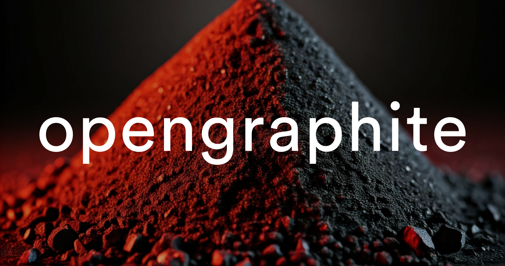

# Opengraphite

A simple tool to generate opengraph tags for your website.

## Features

- Generate opengraph tags for your website
- Supports HTML, Svelte, and SvelteKit
- Customizable opengraph tags
- Copy-paste ready code

## Getting Started

To get started, follow these steps:

1. Clone the repository:

```bash
git clone https://github.com/your-username/opengraphite.git
```

2. Install the dependencies:

```bash
npm install
```

3. Start the development server:

```bash
npm run dev
```

4. Open [http://localhost:3000](http://localhost:3000) in your browser.

## Contributing

Contributions are welcome! If you find a bug or have a suggestion, please open an issue or submit a pull request.

## License

This project is licensed under the MIT License.